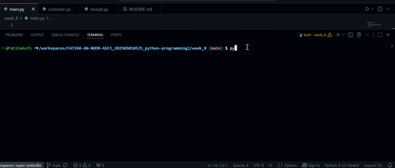

## Purpose of the application 
- The purpose is to organize the file and create a proper utilizable backend receipt generator. 

## Tech Stack
- Enter customer information
- Select food item
- Input quantity and price
- Choose delivery option (Yes/No)
- Automatically calculate:
  - Subtotal
  - Service charge (5%)
  - Delivery charge (RM5.00 if delivery is selected)
  - Grand total
- Print a formatted receipt

## Technologies Used

- Python 3
- Visual Studio Code
- Git & GitHub

## Project Structure
- main.py
- customer.py
- receipt.py
- README.md

## How to Run the Application

1. Open the project folder in Visual Studio Code.
2. Make sure Python 3 is installed.
3. Open the terminal.
4. Run the following command:python main.py
5. Enter the required customer information.
6. The receipt will be displayed automatically.

# App Demonstration 
- 
